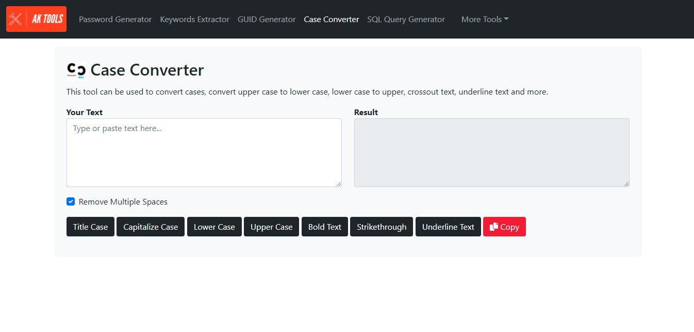

# case-converter

Convert a strings to a different cases using this JavaScript library

  <kbd>
    
  </kbd>

## Description

This easy-to-use Case Conversion Tool is designed to allow you to convert blocks of text into any case, which you can then copy and paste back to your own document.

### Features

- Title Case
- Capitalize Case
- Lower Case
- Upper Case
- Bold Text
- Strikethrough
- Underline Text

### Built with

- Javascript
- HTML + CSS

### Demo

- [aktools.net/case-converter/](https://aktools.net/case-converter/)

## Getting started

### Install

All you have to do is download the source files, no configurations needed. Place the the files somewhere on your system and open the `index.html` file located at: `\case-converter\index.html`

### Usage

Simply copy and paste your text into the text area and click on the buttons at the bottom to convert it to one of the different cases

### See also

- [password-generator](https://github.com/akassama/password-generator)
- [sql-query-generator](https://github.com/akassama/sql-query-generator)
- [keywords-extractor](https://github.com/akassama/keywords-extractor)
- [guid-generator](https://github.com/akassama/guid-generator)
- [keywords-extractor](https://github.com/akassama/keywords-extractor)
- [text-notepad](https://github.com/akassama/text-notepad)
- [jquery-character-counter](https://github.com/akassama/jquery-character-counter)
- [bootstrap-search-autocomplete](https://github.com/akassama/bootstrap-search-autocomplete)
- [jquery-datables-crud](https://github.com/akassama/jquery-datables-crud)
- [bootstrap-search-autocomplete](https://github.com/akassama/bootstrap-search-autocomplete)
- [akassama-projects](https://github.com/akassama/projects)

### License

This project is licensed under the [MIT License](https://opensource.org/licenses/MIT).